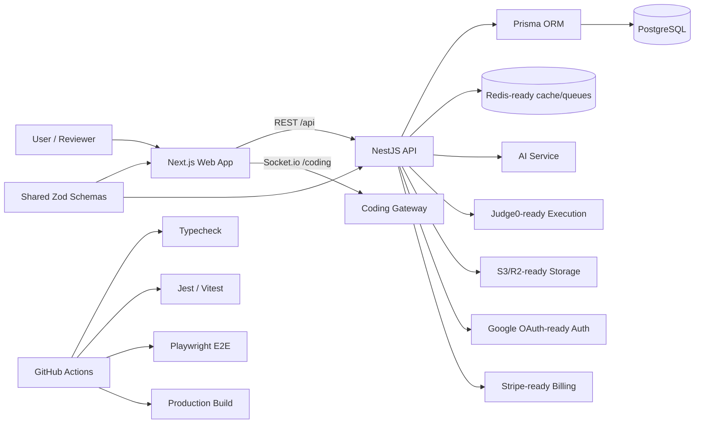

# DevElevate AI Architecture

DevElevate AI is organized as a production-style TypeScript monorepo with separate frontend, backend, shared contracts, infrastructure config, and test layers.

## System Diagram

## Frontend

- Next.js app router with React and TypeScript.
- Tailwind-based UI components.
- Zustand persisted session state.
- Monaco editor for coding-room experience.
- Recharts analytics visualizations.
- Demo-mode fallbacks for reviewer-friendly no-cost testing.

## Backend

- NestJS modular API.
- Prisma data access layer.
- JWT auth with refresh-token rotation.
- Role-protected admin overview.
- Socket.io coding gateway.
- Resume parsing for PDF, DOCX, text, and Markdown.
- Local deterministic fallback intelligence when OpenAI is not configured.
- Liveness and readiness endpoints for deployment checks.

## Shared Contracts

`packages/shared` contains Zod schemas and TypeScript types used by both frontend and backend. This keeps payload validation consistent across the monorepo.

## Data And Integrations

Core local stack:

- PostgreSQL for application data.
- Redis-ready configuration for future distributed rate limiting and queues.

Optional external integrations:

- OpenAI for live AI generation.
- Judge0 for real code execution.
- Google OAuth for social sign-in.
- Stripe for billing.
- S3/R2 for production file storage.

The default demo path does not require paid services.

## Verification Layers

- API unit tests with Jest.
- Web smoke tests with Vitest and Testing Library.
- Browser E2E demo-flow test with Playwright.
- Production build validation.
- GitHub Actions runs the verification flow on `main`.
